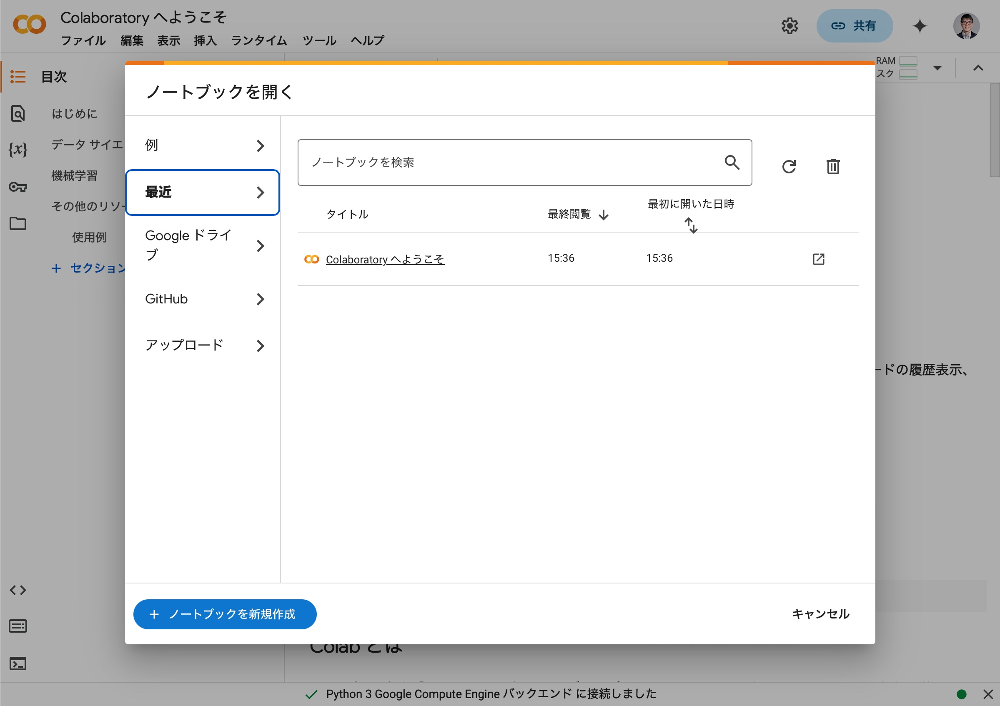
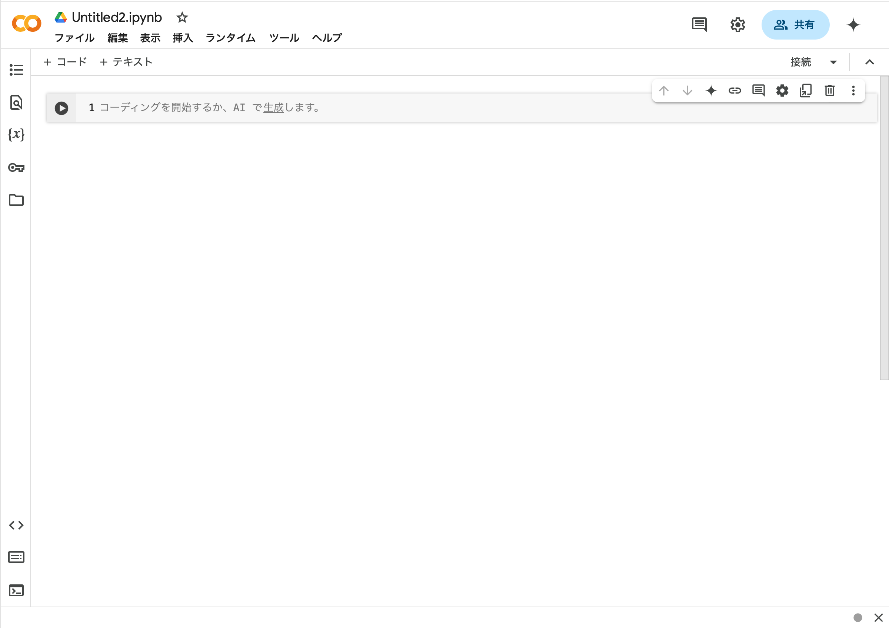

%title: "ドキュメントのタイトル"
%author: "山田 太郎"
%date: "2023-02-24"
%description: "説明やサマリーを入れることも"

本資料ではPythoでの統計分析の方法について説明していく．

# Python実行環境の整備

## Google Colaboratoryへのサインインとノートブック作成

Pythonの開発・実行環境を最も手軽に手に入れられるのはGoogle Colaboratory（Google Colab）であろう．そこで，本資料ではGoogle Colabを用いていくことを前提とする．

まずは以下のリンクを開いてほしい．
[Google Colab](https://colab.research.google.com)

すると次のような画面が表示される．


この右上にある「ログイン」（もしくはサインイン）をクリックし，各自のGoogleアカウントでログインをする．

すると次のような画面となる．



この画面の下の方にある「ノートブックを新規作成」をクリックすると，以下のように新しいノートブックが立ち上がり，pythonを実行できる環境が整う．



## とりあえず実行

まずは極簡単なpythonプログラムを入力・実行させてみよう．
画面には，次のような部分が表示されている（この部分を**コードセル**と呼ぶ）ので，この部分に次のコードを入力してみてほしい．


```python
print("hello world")
```

    hello world


これは至って単純な命令で，「画面に”hello world”を表示せよ」という命令である．

入力が済んだら，Ctrlキーを押しながらEnterキーを押すか，マウスで行の左側にある再生マーク（▶︎）をクリックする．
すると，上記のコードが実行され，次のような表記が現れる．
(初めて実行するときには，pythonの初期設定等を内部で行うため，やや時間がかかるが，１度実行すればその後はこのような時間がかかることはない．)


```python
print("hello world")
```

    hello world


極めて簡単な例であるが，pythonのプログラムが実行され，その結果が返ってきた，ということである．

## 基本的な計算の実行

では今度は簡単な計算を実行させてみよう．
print()の中に数式を書き入れて，セルをCtrl+Enterもしくは▶︎で実行してみる．


```python
print(5+1)
print(5-7)
print(6*4)
print(9/3)
```

    6
    -2
    24
    3.0


上記のように，各行の計算が実行され，その結果が画面に出力させる．

カッコを使ったり，累乗計算をさせたり，剰余演算をさせたりもできる．


```python
# カッコ付き
print((5+1)*3)

# 複数のカッコを使った計算
print(((5+1)*4+3)/2+(3-1))

# 累乗 (pythonでは*を2つ重ねると累乗の演算式となる．)
print(2**3)

# 割り算の商だけを取得
print(10//3)

# 割り算の余りだけを取得
print(10%3)
```

    18
    15.5
    8
    3
    1


| 名前   | 年齢 | 性別 |
|--------|------|------|
| 山田太郎 | 25   | 男性 |
| 佐藤花子 | 30   | 女性 |
| 鈴木一郎 | 35   | 男性 |

このように，`+`，`-`，`*`，`/`，`()`，`**`，`%%`などの演算記号のことを**演算子(Operator)**呼ぶ．演算子にはこれら以外にもいろいろある．以下にpythonで使われる代表的な演算子を示す．

| 演算子 | 説明                       |
|------|-----------------------------|
|x + y | 加算　|
|x + y | 減算　|

| 算術演算子 | 説明                       |
|--------|----------------------------|
| `x + y`  | 加算                       |
| x - y  | 減算                       |
| x * y  | 乗算                       |
| x / y  | 除算                       |
| x ** y | 累乗                       |
| x % y  | 剰余                       |
| x // y | 整数除算                   |
| x = y  | 代入                       |
| x += y | 加算代入                   |
| x -= y | 減算代入                   |
| x *= y | 乗算代入                   |
| x /= y | 除算代入                   |
| x //= y| 整数除算代入               |
| x %= y | 剰余代入                   |
| x **= y| 累乗代入                   |

| 比較演算子 | 説明                       |
|--------|----------------------------|
| x == y | 等しい                     |
| x != y | 等しくない                 |
| `x \&lt; y`  | より小さい                 |
| `x \&gt; y`  | より大きい                 |
| `x \&lt;= y` | 以下                       |
| `x \&gt;= y` | 以上                       |
| `x \&amp; y`  | 論理積 (AND)               |
| x | y  | 論理和 (OR)                |
| not x  | 否定 (NOT)                 |
| x is y | 同一オブジェクトかどうか   |
| x is not y | 同一オブジェクトでないか|
| x in y | 要素が含まれるか           |
| x not in y | 要素が含まれないか      |

## モジュールと関数の利用

上記のような単純な演算はそのまま数式を入力することで実行できるが，より高度な処理をさせる際には**関数**と呼ばれるものを用いる（すでに使ってきたprint()も関数である）．

関数の多くはpython本体とは別にモジュールと呼ばれるものの中で作られているため，そうした関数を実行するためにはモジュールを読み込む命令を書き込んでおく必要がある．

実際に，より高度な処理として平方根を算出してみよう．
次の例は121の平方根を求めて画面に表示させている．


```python
import math
print(math.sqrt(121))
```

    11.0


1行目の`import math`がモジュールを読み込んでいる命令である．これによりmathモジュールが現在のノートブックに読み込まれる．

続いて，math.sqrt()が与えた数の平方根を求める関数である．`math`と`.`と`sqrt()`という3つの部分で構成されており，`math`が読み込んだモジュール名，`sqrt()`が関数となっている．

このようにpythonでは「モジュール名+`.`＋関数」と記述することで各モジュールが提供している関数を利用することができる．

例えば，絶対値を求めるときには`fabs()`という関数を使う．なお，mathモジュールはすでに一度このノートブック上で読み込んでいるので改めて読み込む必要はない．


```python
print(math.fabs(-10.63))
```

    10.63


<div class="work">
次の計算を行いなさい．

- 25 * 3 + 4 / 2
- 11^3
- 100 %% 7
- 2 * (3 + 4) - 5
- 2^3 * 3^2
- ((2 + 3) * (4 + 5)) / 6
- 3+4*5-6/3
- 453 %/% 10
- 453 %% 10
- 256の正の平方根

</div>
